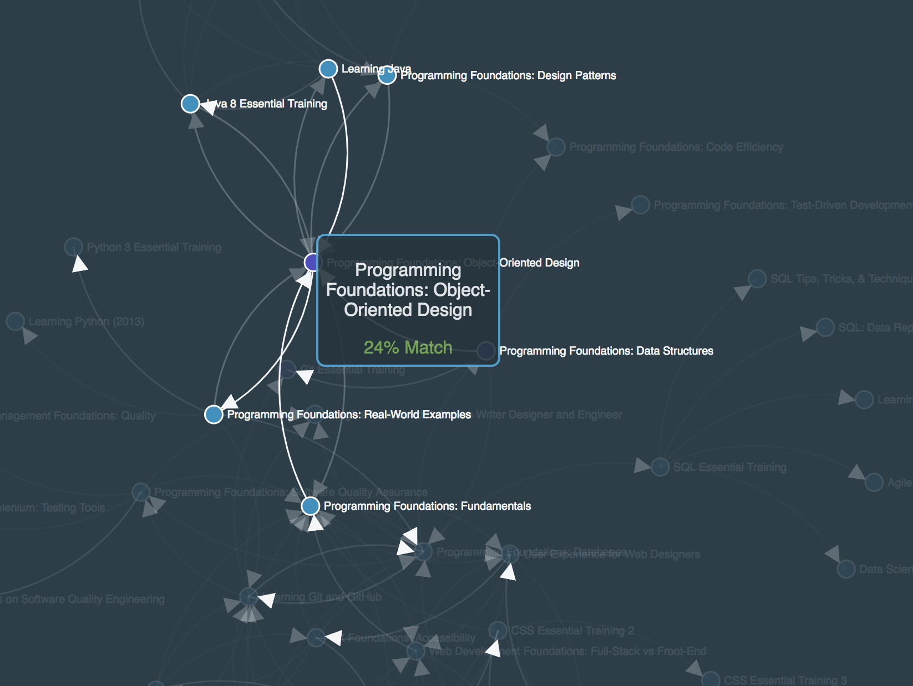

# A D3 experiment using MOOC data

# Steps to run
- Clone the repo
- cd into the repo 
- run `npm install`
- ryb `npm run build` to generate the bundle
- run `npm run start` to start the server
- navigate to http://localhost:8080/

Big thanks to [@MBostock](https://github.com/mbostock) for his examples

# Screenshot of result

